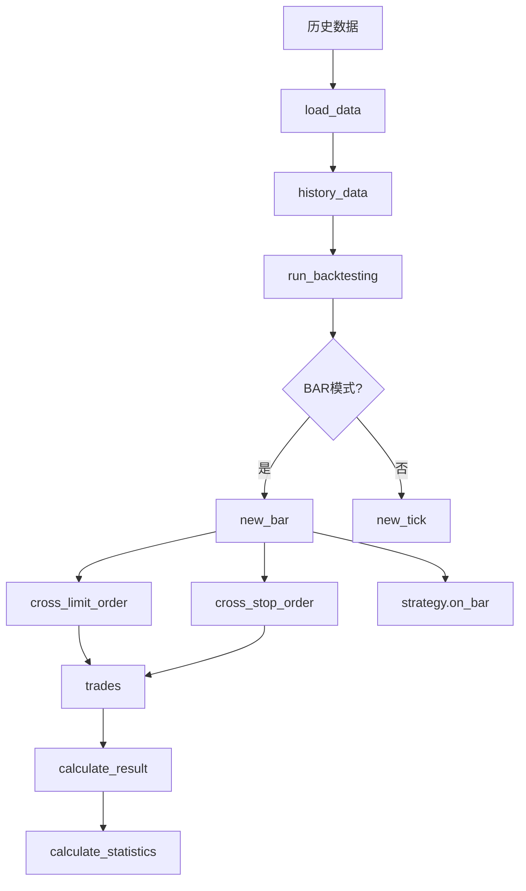

# vn.py 回测引擎深度解析

**版本**: vn.py 3.x
**文档日期**: 2026-02-20
**作者**: vn.py 深度解析专家

---

## 目录

1. [BacktestingEngine 核心架构](#1-backtestingengine-核心架构)
2. [回测流程详解](#2-回测流程详解)
3. [历史数据加载机制](#3-历史数据加载机制)
4. [回测参数配置](#4-回测参数配置)
5. [回测结果计算](#5-回测结果计算)
6. [参数优化功能](#6-参数优化功能)
7. [性能瓶颈和优化技巧](#7-性能瓶颈和优化技巧)
8. [回测与实盘的差异](#8-回测与实盘的差异)
9. [完整代码示例](#9-完整代码示例)

---

## 1. BacktestingEngine 核心架构

### 1.1 架构概览

vn.py 的回测引擎基于事件驱动架构，核心类是 `BacktestingEngine`，位于 `vnpy_ctastrategy.backtesting` 模块中。该引擎模拟了完整的交易环境，包括订单管理、成交撮合、资金计算等功能。

**核心类层次结构：**

```
BacktestingEngine (回测引擎)
    ├── CtaTemplate (策略基类)
    │   └── 用户策略
    ├── DailyResult (每日结果)
    ├── StopOrder (停止单)
    ├── OrderData (限价单)
    └── TradeData (成交数据)
```

### 1.2 BacktestingEngine 类结构

```python
class BacktestingEngine:
    """回测引擎核心类"""
    
    # 引擎类型
    engine_type: EngineType = EngineType.BACKTESTING
    gateway_name: str = "BACKTESTING"
    
    # 交易参数
    vt_symbol: str = ""              # 合约代码
    symbol: str = ""                 # 交易品种
    exchange: Exchange               # 交易所
    start: datetime                  # 回测开始时间
    end: datetime                    # 回测结束时间
    rate: float = 0                  # 手续费率
    slippage: float = 0              # 滑点
    size: float = 1                  # 合约乘数
    pricetick: float = 0            # 最小价格单位
    capital: int = 1_000_000         # 初始资金
    
    # 高级参数
    risk_free: float = 0             # 无风险利率
    annual_days: int = 240           # 年交易日数
    half_life: int = 120             # 半衰期（用于EWM Sharpe）
    mode: BacktestingMode = BacktestingMode.BAR  # 回测模式
    
    # 策略相关
    strategy_class: type[CtaTemplate]
    strategy: CtaTemplate
    
    # 订单管理
    stop_orders: dict[str, StopOrder] = {}        # 所有停止单
    active_stop_orders: dict[str, StopOrder] = {} # 活跃停止单
    limit_orders: dict[str, OrderData] = {}       # 所有限价单
    active_limit_orders: dict[str, OrderData] = {} # 活跃限价单
    
    # 成交和日志
    trades: dict[str, TradeData] = {}    # 所有成交记录
    logs: list = []                       # 日志记录
    
    # 结果计算
    daily_results: dict[Date, DailyResult] = {}  # 每日结果
    daily_df: DataFrame = DataFrame()             # 每日数据框
```

### 1.3 核心数据流



### 1.4 事件循环机制

回测引擎采用事件驱动模式，每个 BAR/TICK 都会触发一系列事件：

```python
def new_bar(self, bar: BarData) -> None:
    """处理新K线"""
    self.bar = bar
    self.datetime = bar.datetime
    
    # 1. 检查限价单成交
    self.cross_limit_order()
    
    # 2. 检查停止单触发
    self.cross_stop_order()
    
    # 3. 触发策略回调
    self.strategy.on_bar(bar)
    
    # 4. 更新每日收盘价
    self.update_daily_close(bar.close_price)
```

---

## 2. 回测流程详解

### 2.1 完整回测流程

```python
from vnpy_ctastrategy.backtesting import BacktestingEngine
from datetime import datetime

# 1. 创建回测引擎
engine = BacktestingEngine()

# 2. 设置回测参数
engine.set_parameters(
    vt_symbol="IF2602.CFFEX",
    interval=Interval.MINUTE,
    start=datetime(2024, 1, 1),
    end=datetime(2024, 12, 31),
    rate=0.3/10000,      # 手续费率
    slippage=0.2,        # 滑点
    size=300,            # 合约乘数
    pricetick=0.2,       # 最小价格单位
    capital=1_000_000,   # 初始资金
    mode=BacktestingMode.BAR,
    risk_free=0.03,      # 无风险利率 3%
    annual_days=240,     # 年交易日数
    half_life=120        # EWM Sharpe 半衰期
)

# 3. 添加策略
engine.add_strategy(MyStrategy, {"fast_window": 10, "slow_window": 20})

# 4. 加载历史数据
engine.load_data()

# 5. 运行回测
engine.run_backtesting()

# 6. 计算结果
df = engine.calculate_result()

# 7. 计算统计指标
stats = engine.calculate_statistics()

# 8. 显示图表
fig = engine.show_chart()
```

### 2.2 初始化阶段详解

```python
def set_parameters(self, ...):
    """设置回测参数"""
    # 解析合约代码
    self.symbol, exchange_str = self.vt_symbol.split(".")
    self.exchange = Exchange(exchange_str)
    
    # 设置回测范围
    self.end = self.end.replace(hour=23, minute=59, second=59)
    
def add_strategy(self, strategy_class: type[CtaTemplate], setting: dict):
    """添加策略"""
    self.strategy_class = strategy_class
    # 创建策略实例，传入引擎自身
    self.strategy = strategy_class(
        self, strategy_class.__name__, self.vt_symbol, setting
    )
```

### 2.3 数据加载阶段详解

```python
def load_data(self) -> None:
    """加载历史数据"""
    self.output("开始加载历史数据")
    
    # 计算总天数和分批大小
    total_days = (self.end - self.start).days
    progress_days = max(int(total_days / 10), 1)
    progress_delta = timedelta(days=progress_days)
    interval_delta = INTERVAL_DELTA_MAP[self.interval]
    
    start = self.start
    end = self.start + progress_delta
    progress = 0
    
    # 分批加载数据，每批最多30天
    while start < self.end:
        # 显示进度条
        progress_bar = "#" * int(progress * 10 + 1)
        self.output(f"加载进度：{progress_bar} [{progress:.0%}]")
        
        end = min(end, self.end)
        
        # 从数据库加载数据
        if self.mode == BacktestingMode.BAR:
            data = load_bar_data(
                self.symbol,
                self.exchange,
                self.interval,
                start,
                end
            )
        else:
            data = load_tick_data(
                self.symbol,
                self.exchange,
                start,
                end
            )
        
        # 累加到历史数据列表
        self.history_data.extend(data)
        
        # 更新进度和起始时间
        progress += progress_days / total_days
        progress = min(progress, 1)
        start = end + interval_delta
        end += progress_delta
    
    self.output(f"历史数据加载完成，数据量：{len(self.history_data)}")
```

### 2.4 回测运行阶段详解

```python
def run_backtesting(self) -> None:
    """运行回测"""
    # 根据模式选择回调函数
    if self.mode == BacktestingMode.BAR:
        func = self.new_bar
    else:
        func = self.new_tick
    
    # 1. 初始化策略
    self.strategy.on_init()
    self.strategy.inited = True
    self.output("策略初始化完成")
    
    # 2. 启动策略
    self.strategy.on_start()
    self.strategy.trading = True
    self.output("开始回放历史数据")
    
    # 3. 批量回放历史数据
    total_size = len(self.history_data)
    batch_size = max(int(total_size / 10), 1)
    
    for ix, i in enumerate(range(0, total_size, batch_size)):
        batch_data = self.history_data[i: i + batch_size]
        for data in batch_data:
            try:
                func(data)  # 调用 new_bar 或 new_tick
            except Exception:
                self.output("触发异常，回测终止")
                self.output(traceback.format_exc())
                return
        
        # 显示进度
        progress = min(ix / 10, 1)
        progress_bar = "=" * (ix + 1)
        self.output(f"回放进度：{progress_bar} [{progress:.0%}]")
    
    # 4. 停止策略
    self.strategy.on_stop()
    self.output("历史数据回放结束")
```

### 2.5 结果计算阶段详解

```python
def calculate_result(self) -> DataFrame:
    """计算逐日盯市盈亏"""
    self.output("开始计算逐日盯市盈亏")
    
    # 1. 将成交记录添加到每日结果
    for trade in self.trades.values():
        if not trade.datetime:
            continue
        d = trade.datetime.date()
        daily_result = self.daily_results[d]
        daily_result.add_trade(trade)
    
    # 2. 迭代计算每日盈亏
    pre_close = 0
    start_pos = 0
    
    for daily_result in self.daily_results.values():
        daily_result.calculate_pnl(
            pre_close,
            start_pos,
            self.size,
            self.rate,
            self.slippage
        )
        
        pre_close = daily_result.close_price
        start_pos = daily_result.end_pos
    
    # 3. 生成 DataFrame
    results = defaultdict(list)
    for daily_result in self.daily_results.values():
        for key, value in daily_result.__dict__.items():
            results[key].append(value)
    
    if results:
        self.daily_df = DataFrame.from_dict(results).set_index("date")
    
    self.output("逐日盯市盈亏计算完成")
    return self.daily_df
```

---

## 3. 历史数据加载机制

### 3.1 数据加载架构

vn.py 使用数据库抽象层 `BaseDatabase` 来加载历史数据，支持多种数据库（SQLite、MySQL、PostgreSQL 等）。

```python
@lru_cache(maxsize=999)
def load_bar_data(
    symbol: str,
    exchange: Exchange,
    interval: Interval,
    start: datetime,
    end: datetime
) -> list[BarData]:
    """从数据库加载K线数据"""
    database = get_database()
    return database.load_bar_data(symbol, exchange, interval, start, end)

@lru_cache(maxsize=999)
def load_tick_data(
    symbol: str,
    exchange: Exchange,
    start: datetime,
    end: datetime
) -> list[TickData]:
    """从数据库加载Tick数据"""
    database = get_database()
    return database.load_tick_data(symbol, exchange, start, end)
```

### 3.2 数据加载优化

**使用 LRU 缓存：**

```python
# load_bar_data 和 load_tick_data 使用了 @lru_cache 装饰器
# 缓存最近 999 次查询结果，避免重复查询数据库
@lru_cache(maxsize=999)
def load_bar_data(...):
    ...
```

**分批加载机制：**

```python
# 每批最多加载 30 天数据，支持进度显示
total_days = (self.end - self.start).days
progress_days = max(int(total_days / 10), 1)
progress_delta = timedelta(days=progress_days)

while start < self.end:
    # 加载一批数据
    data = load_bar_data(symbol, exchange, interval, start, end)
    self.history_data.extend(data)
    
    # 更新进度
    start = end + interval_delta
    end += progress_delta
```

### 3.3 数据格式要求

**BarData 结构：**

```python
@dataclass
class BarData:
    """K线数据"""
    symbol: str
    exchange: Exchange
    datetime: datetime
    interval: Interval
    
    open_price: float
    high_price: float
    low_price: float
    close_price: float
    volume: float
    turnover: float
    
    open_interest: float = 0
    gateway_name: str = ""
```

**TickData 结构：**

```python
@dataclass
class TickData:
    """Tick数据"""
    symbol: str
    exchange: Exchange
    datetime: datetime
    
    name: str = ""
    volume: float = 0
    turnover: float = 0
    open_interest: float = 0
    last_price: float = 0
    last_volume: float = 0
    
    limit_up: float = 0
    limit_down: float = 0
    
    open_price: float = 0
    high_price: float = 0
    low_price: float = 0
    pre_close: float = 0
    
    bid_price_1: float = 0
    bid_price_2: float = 0
    bid_price_3: float = 0
    bid_price_4: float = 0
    bid_price_5: float = 0
    
    ask_price_1: float = 0
    ask_price_2: float = 0
    ask_price_3: float = 0
    ask_price_4: float = 0
    ask_price_5: float = 0
    
    bid_volume_1: float = 0
    bid_volume_2: float = 0
    bid_volume_3: float = 0
    bid_volume_4: float = 0
    bid_volume_5: float = 0
    
    ask_volume_1: float = 0
    ask_volume_2: float = 0
    ask_volume_3: float = 0
    ask_volume_4: float = 0
    ask_volume_5: float = 0
```

---

## 4. 回测参数配置

### 4.1 基本参数

```python
engine.set_parameters(
    # 合约信息
    vt_symbol="IF2602.CFFEX",    # 合约代码
    interval=Interval.MINUTE,    # K线周期
    
    # 时间范围
    start=datetime(2024, 1, 1),  # 回测开始时间
    end=datetime(2024, 12, 31),  # 回测结束时间
    
    # 交易成本
    rate=0.3/10000,              # 手续费率（万分之一）
    slippage=0.2,                # 滑点（每个价位的滑点）
    
    # 合约属性
    size=300,                    # 合约乘数
    pricetick=0.2,               # 最小价格单位
    
    # 资金设置
    capital=1_000_000,           # 初始资金
)
```

### 4.2 手续费配置

**按比例收取手续费：**

```python
# 手续费 = 成交金额 * rate
# 示例：成交价格 4000，数量 1 手，合约乘数 300
# 成交金额 = 4000 * 1 * 300 = 1,200,000
# 手续费 = 1,200,000 * 0.3/10000 = 36 元

engine.set_parameters(
    rate=0.3/10000,  # 万分之三
    ...
)
```

**按固定金额收取手续费：**

```python
# 需要在策略中自行计算手续费
# 或者在 calculate_pnl 中修改计算逻辑
```

### 4.3 滑点配置

**固定滑点：**

```python
# 滑点 = 成交数量 * 合约乘数 * slippage
# 示例：成交数量 1 手，合约乘数 300，滑点 0.2
# 滑点 = 1 * 300 * 0.2 = 60 元

engine.set_parameters(
    slippage=0.2,  # 每个价位的滑点
    ...
)
```

**动态滑点（需要自定义）：**

```python
# 在策略中根据市场情况动态调整
# 例如：根据订单大小、波动率等计算滑点
```

### 4.4 杠杆配置

vn.py 回测引擎不直接支持杠杆配置，但可以通过调整初始资金来模拟杠杆效果：

```python
# 无杠杆（全额交易）
engine.set_parameters(
    capital=1_000_000,  # 100万资金，可以交易 100万价值的合约
    ...
)

# 10倍杠杆（只需 10% 的保证金）
engine.set_parameters(
    capital=100_000,  # 10万资金，可以交易 100万价值的合约
    ...
)

# 20倍杠杆（只需 5% 的保证金）
engine.set_parameters(
    capital=50_000,  # 5万资金，可以交易 100万价值的合约
    ...
)
```

### 4.5 高级参数

```python
engine.set_parameters(
    # 回测模式
    mode=BacktestingMode.BAR,  # BAR 模式 vs TICK 模式
    
    # 风险指标参数
    risk_free=0.03,      # 无风险利率 3%
    annual_days=240,     # 年交易日数（中国股市）
    half_life=120,       # EWM Sharpe 半衰期
    ...
)
```

### 4.6 回测模式对比

**BAR 模式（K线回测）：**

```python
mode=BacktestingMode.BAR

# 特点：
# - 使用 K 线数据回测
# - 成交逻辑基于 K 线的开盘价、最高价、最低价、收盘价
# - 速度快，适合大范围回测
# - 精度较低，无法模拟日内精细成交

# 成交规则：
# - 买单：如果限价 >= K线最低价，则在开盘价成交
# - 卖单：如果限价 <= K线最高价，则在开盘价成交
```

**TICK 模式（Tick回测）：**

```python
mode=BacktestingMode.TICK

# 特点：
# - 使用 Tick 数据回测
# - 成交逻辑基于 Tick 的买卖价格
# - 速度慢，适合精细回测
# - 精度高，可以模拟实际成交情况

# 成交规则：
# - 买单：如果限价 >= Ask1，则在 Ask1 成交
# - 卖单：如果限价 <= Bid1，则在 Bid1 成交
```

---

## 5. 回测结果计算

### 5.1 每日盈亏计算

```python
class DailyResult:
    """每日结果计算"""
    
    def calculate_pnl(
        self,
        pre_close: float,    # 前一日收盘价
        start_pos: float,    # 起始持仓
        size: float,         # 合约乘数
        rate: float,         # 手续费率
        slippage: float      # 滑点
    ) -> None:
        """计算每日盈亏"""
        
        # 1. 持仓盈亏（持有仓位的价格变化）
        self.start_pos = start_pos
        self.end_pos = start_pos
        
        # 持仓盈亏 = 持仓数量 * (收盘价 - 前收盘价) * 合约乘数
        self.holding_pnl = self.start_pos * (self.close_price - pre_close) * size
        
        # 2. 交易盈亏（当日交易的盈亏）
        for trade in self.trades:
            if trade.direction == Direction.LONG:
                pos_change = trade.volume  # 买入增加持仓
            else:
                pos_change = -trade.volume  # 卖出减少持仓
            
            self.end_pos += pos_change
            
            # 计算成交金额
            turnover = trade.volume * size * trade.price
            
            # 交易盈亏 = 成交数量 * (收盘价 - 成交价) * 合约乘数
            self.trading_pnl += pos_change * (self.close_price - trade.price) * size
            
            # 计算滑点成本
            self.slippage += trade.volume * size * slippage
            
            # 计算手续费
            self.turnover += turnover
            self.commission += turnover * rate
        
        # 3. 总盈亏 = 持仓盈亏 + 交易盈亏
        self.total_pnl = self.trading_pnl + self.holding_pnl
        
        # 4. 净盈亏 = 总盈亏 - 手续费 - 滑点
        self.net_pnl = self.total_pnl - self.commission - self.slippage
```

### 5.2 统计指标计算

```python
def calculate_statistics(self, df: DataFrame | None = None, output: bool = True) -> dict:
    """计算统计指标"""
    
    # 1. 计算资金曲线
    df["balance"] = df["net_pnl"].cumsum() + self.capital
    
    # 2. 计算每日收益率
    pre_balance = df["balance"].shift(1)
    pre_balance.iloc[0] = self.capital
    x = df["balance"] / pre_balance
    x[x <= 0] = np.nan  # 爆仓时设置为 nan
    df["return"] = np.log(x).fillna(0)  # 对数收益率
    
    # 3. 计算最高水位线
    df["highlevel"] = df["balance"].rolling(
        min_periods=1,
        window=len(df),
        center=False
    ).max()
    
    # 4. 计算回撤
    df["drawdown"] = df["balance"] - df["highlevel"]
    df["ddpercent"] = df["drawdown"] / df["highlevel"] * 100
    
    # 5. 计算基本统计
    start_date = df.index[0]
    end_date = df.index[-1]
    total_days = len(df)
    profit_days = len(df[df["net_pnl"] > 0])
    loss_days = len(df[df["net_pnl"] < 0])
    
    end_balance = df["balance"].iloc[-1]
    max_drawdown = df["drawdown"].min()
    max_ddpercent = df["ddpercent"].min()
    
    # 6. 计算收益率
    total_return = (end_balance / self.capital - 1) * 100
    annual_return = total_return / total_days * self.annual_days
    daily_return = df["return"].mean() * 100
    return_std = df["return"].std() * 100
    
    # 7. 计算 Sharpe Ratio
    if return_std:
        daily_risk_free = self.risk_free / np.sqrt(self.annual_days)
        sharpe_ratio = (daily_return - daily_risk_free) / return_std * np.sqrt(self.annual_days)
        
        # EWM Sharpe（指数加权移动平均）
        ewm_window = df["return"].ewm(halflife=self.half_life)
        ewm_mean = ewm_window.mean() * 100
        ewm_std = ewm_window.std() * 100
        ewm_sharpe = ((ewm_mean - daily_risk_free) / ewm_std).iloc[-1] * np.sqrt(self.annual_days)
    
    # 8. 计算收益回撤比
    if max_ddpercent:
        return_drawdown_ratio = -total_return / max_ddpercent
    
    # 9. 计算 RGR Ratio（综合风险收益比）
    rgr_ratio = calc_rgr_ratio(
        annual_return / 100,
        1 / (1 + return_std / 100),
        annual_downside_risk,
        max_ddpercent,
        return_skew,
        return_kurt,
        cvar_95
    )
    
    return {
        "start_date": start_date,
        "end_date": end_date,
        "total_days": total_days,
        "profit_days": profit_days,
        "loss_days": loss_days,
        "capital": self.capital,
        "end_balance": end_balance,
        "max_drawdown": max_drawdown,
        "max_ddpercent": max_ddpercent,
        "total_net_pnl": df["net_pnl"].sum(),
        "total_commission": df["commission"].sum(),
        "total_slippage": df["slippage"].sum(),
        "total_turnover": df["turnover"].sum(),
        "total_return": total_return,
        "annual_return": annual_return,
        "daily_return": daily_return,
        "return_std": return_std,
        "sharpe_ratio": sharpe_ratio,
        "ewm_sharpe": ewm_sharpe,
        "return_drawdown_ratio": return_drawdown_ratio,
        "rgr_ratio": rgr_ratio,
    }
```

### 5.3 Sharpe Ratio 计算详解

**传统 Sharpe Ratio：**

```python
# 公式：Sharpe = (E[R] - Rf) / σ[R]
# 其中：
# - E[R]：预期收益率
# - Rf：无风险利率
# - σ[R]：收益率标准差

daily_return = df["return"].mean() * 100  # 日均收益率
return_std = df["return"].std() * 100     # 日收益率标准差
daily_risk_free = self.risk_free / np.sqrt(self.annual_days)  # 日无风险利率

# 年化 Sharpe Ratio
sharpe_ratio = (daily_return - daily_risk_free) / return_std * np.sqrt(self.annual_days)
```

**EWM Sharpe Ratio（指数加权）：**

```python
# 使用指数加权移动平均计算，更关注近期表现
ewm_window = df["return"].ewm(halflife=self.half_life)  # 半衰期 120 天
ewm_mean = ewm_window.mean() * 100
ewm_std = ewm_window.std() * 100

ewm_sharpe = ((ewm_mean - daily_risk_free) / ewm_std).iloc[-1] * np.sqrt(self.annual_days)
```

### 5.4 回撤计算详解

```python
# 计算最高水位线
df["highlevel"] = df["balance"].rolling(
    min_periods=1,
    window=len(df),
    center=False
).max()

# 计算回撤金额
df["drawdown"] = df["balance"] - df["highlevel"]

# 计算回撤百分比
df["ddpercent"] = df["drawdown"] / df["highlevel"] * 100

# 最大回撤
max_drawdown = df["drawdown"].min()
max_ddpercent = df["ddpercent"].min()

# 最大回撤持续时间
max_drawdown_end = df["drawdown"].idxmin()
max_drawdown_start = df["balance"][:max_drawdown_end].idxmax()
max_drawdown_duration = (max_drawdown_end - max_drawdown_start).days
```

---

## 6. 参数优化功能

### 6.1 参数优化概述

vn.py 提供了两种参数优化算法：
- **暴力搜索（Brute Force）**：遍历所有参数组合
- **遗传算法（Genetic Algorithm）**：使用进化算法寻找最优解

### 6.2 暴力搜索优化

```python
from vnpy_ctastrategy.backtesting import OptimizationSetting

# 创建优化设置
optimization_setting = OptimizationSetting()

# 添加优化参数
# add_parameter(name, start, end, step)
optimization_setting.add_parameter("fast_window", 5, 20, 5)   # 5, 10, 15, 20
optimization_setting.add_parameter("slow_window", 20, 60, 10) # 20, 30, 40, 50, 60
optimization_setting.add_parameter("fixed_size", 1, 3, 1)      # 1, 2, 3

# 总共 4 * 5 * 3 = 60 个参数组合

# 运行优化
results = engine.run_optimization(
    optimization_setting,
    target_name="sharpe_ratio",  # 优化目标
    max_workers=4,                # 使用 4 个进程并行计算
    output=True
)

# 结果排序
results.sort(key=lambda x: x[1], reverse=True)  # 按 Sharpe Ratio 降序排序

# 打印最优参数
best_setting, best_value, best_stats = results[0]
print(f"最优参数：{best_setting}")
print(f"Sharpe Ratio：{best_value}")
```

### 6.3 遗传算法优化

```python
# 遗传算法参数设置
results = engine.run_ga_optimization(
    optimization_setting,
    target_name="sharpe_ratio",
    
    # 种群参数
    pop_size=100,      # 种群大小
    ngen=30,           # 迭代代数
    mu=100,            # 每代选择的个体数
    lambda_=200,       # 每代生成的个体数
    
    # 遗传操作参数
    cxpb=0.95,         # 交叉概率
    mutpb=0.1,         # 变异概率
    indpb=0.1,         # 每个基因的变异概率
    
    max_workers=4,     # 并行进程数
    output=True
)

# 遗传算法更适合参数空间较大的情况
# 可以在较少的迭代次数内找到较好的解
```

### 6.4 优化目标选择

vn.py 支持多种优化目标：

```python
# 常用优化目标
optimization_setting.target_name = "sharpe_ratio"      # 夏普比率
optimization_setting.target_name = "annual_return"     # 年化收益率
optimization_setting.target_name = "max_drawdown"      # 最大回撤（越小越好）
optimization_setting.target_name = "return_drawdown_ratio"  # 收益回撤比
optimization_setting.target_name = "rgr_ratio"         # RGR 比率（综合指标）
```

### 6.5 多目标优化

vn.py 原生不支持多目标优化，但可以通过组合指标实现：

```python
# 自定义评估函数
def combined_score(stats):
    """组合多个指标"""
    sharpe = stats.get("sharpe_ratio", 0)
    return_dd = stats.get("return_drawdown_ratio", 0)
    max_dd = stats.get("max_ddpercent", 0)
    
    # 组合得分 = Sharpe + 收益回撤比 - 最大回撤惩罚
    score = sharpe + return_dd - abs(max_dd) / 10
    return score

# 在优化后重新排序
results_with_score = [
    (setting, combined_score(stats), stats)
    for setting, value, stats in results
]
results_with_score.sort(key=lambda x: x[1], reverse=True)
```

---

## 7. 性能瓶颈和优化技巧

### 7.1 性能瓶颈分析

**主要性能瓶颈：**

1. **数据加载 I/O**：频繁的数据库查询
2. **事件处理开销**：每根 K 线都触发多个事件
3. **指标计算**：重复计算复杂指标
4. **日志输出**：频繁的日志写入
5. **内存占用**：存储大量历史数据

### 7.2 数据加载优化

**批量加载数据：**

```python
# 不好的做法：频繁小批量查询
for day in range(1, 32):
    bars = database.get_bar_data(
        symbol="IF2602",
        exchange=Exchange.CFFEX,
        interval=Interval.MINUTE,
        start=datetime(2024, 1, day),
        end=datetime(2024, 1, day, 23, 59)
    )
    process_bars(bars)

# 好的做法：一次性加载所有数据
bars = database.get_bar_data(
    symbol="IF2602",
    exchange=Exchange.CFFEX,
    interval=Interval.MINUTE,
    start=datetime(2024, 1, 1),
    end=datetime(2024, 1, 31, 23, 59)
)
process_bars(bars)
```

**使用缓存：**

```python
# vn.py 已经使用了 LRU 缓存
@lru_cache(maxsize=999)
def load_bar_data(...):
    ...

# 如果多次运行相同参数的回测，缓存会显著提升速度
```

### 7.3 策略代码优化

**使用滑动窗口：**

```python
# 不好的做法：存储所有历史数据
class MemoryHeavyStrategy(CtaTemplate):
    def __init__(self, ...):
        super().__init__(...)
        self.all_bars = []  # 持续增长
    
    def on_bar(self, bar):
        self.all_bars.append(bar)  # 内存泄漏

# 好的做法：使用固定窗口
from collections import deque

class OptimizedStrategy(CtaTemplate):
    def __init__(self, ...):
        super().__init__(...)
        self.bars = deque(maxlen=100)  # 只保留最近 100 根
    
    def on_bar(self, bar):
        self.bars.append(bar)  # 自动删除旧数据
```

**使用 NumPy 加速：**

```python
import numpy as np

class OptimizedStrategy(CtaTemplate):
    def __init__(self, ...):
        super().__init__(...)
        self.close_prices = np.zeros(100)
        self.index = 0
    
    def on_bar(self, bar):
        # 使用 NumPy 数组
        self.close_prices[self.index % 100] = bar.close_price
        self.index += 1
        
        # 向量化计算
        if len(self.bars) >= 20:
            prices = self.close_prices[:len(self.bars)]
            ma20 = np.mean(prices[-20:])
            std20 = np.std(prices[-20:])
```

**减少日志输出：**

```python
class OptimizedStrategy(CtaTemplate):
    def __init__(self, ...):
        super().__init__(...)
        self.bar_count = 0
    
    def on_bar(self, bar):
        self.bar_count += 1
        
        # 只在关键节点输出
        if self.bar_count % 100 == 0:
            self.write_log(f"已处理 {self.bar_count} 根K线")
        
        # 避免频繁的调试日志
        # self.write_log(f"当前价格: {bar.close_price}")  # 删除
```

### 7.4 并行计算优化

**多进程参数优化：**

```python
# 使用多进程加速参数优化
results = engine.run_optimization(
    optimization_setting,
    target_name="sharpe_ratio",
    max_workers=8,  # 使用 8 个进程
    output=True
)

# 多进程可以显著减少优化时间
# 例如：8 进程可以提升 6-7 倍速度
```

### 7.5 内存优化

**及时释放资源：**

```python
class OptimizedStrategy(CtaTemplate):
    def on_stop(self):
        """策略停止时释放资源"""
        # 清空大对象
        self.bars.clear()
        self.indicators.clear()
        
        # 手动触发垃圾回收
        import gc
        gc.collect()
```

**使用生成器：**

```python
def bar_generator(bars, window_size):
    """生成器模式，减少内存占用"""
    window = []
    for bar in bars:
        window.append(bar)
        if len(window) > window_size:
            window.pop(0)
        yield window

# 使用示例
for window in bar_generator(all_bars, 100):
    # 处理窗口数据
    pass
```

---

## 8. 回测与实盘的差异

### 8.1 主要差异点

**1. 订单撮合机制：**

```python
# 回测中的成交逻辑（简化）
def cross_limit_order(self):
    # 买单：如果限价 >= K线最低价，则在开盘价成交
    long_cross = (
        order.direction == Direction.LONG
        and order.price >= self.bar.low_price
    )
    
    # 卖单：如果限价 <= K线最高价，则在开盘价成交
    short_cross = (
        order.direction == Direction.SHORT
        and order.price <= self.bar.high_price
    )
```

**问题：**
- 回测假设订单一定能成交（只要价格满足）
- 没有考虑订单排队、流动性不足等情况
- 成交价格过于理想化

**2. 滑点模型：**

```python
# 回测中的滑点计算
slippage = trade.volume * size * slippage_per_tick

# 问题：固定滑点无法反映市场实际情况
# - 大单可能有更大滑点
# - 流动性差时滑点更大
# - 快速行情时滑点更大
```

**3. 交易成本：**

```python
# 回测中的手续费计算
commission = turnover * rate

# 问题：实际手续费可能更复杂
# - 最低手续费
# - 按阶段收取
# - 不同成交方式（撮合/做市商）费率不同
```

### 8.2 如何减少差异

**1. 使用 TICK 模式：**

```python
# TICK 模式更接近实盘
engine.set_parameters(
    mode=BacktestingMode.TICK,  # 使用 Tick 数据
    ...
)

# TICK 模式的优势：
# - 更精确的成交逻辑
# - 可以模拟订单排队
# - 更真实的滑点
```

**2. 添加延迟模拟：**

```python
class RealisticStrategy(CtaTemplate):
    def __init__(self, ...):
        super().__init__(...)
        self.order_delay = 0  # 订单延迟（K线数）
    
    def on_bar(self, bar):
        # 发送订单
        vt_orderid = self.buy(bar.close_price, 1)
        
        # 记录订单时间
        self.order_time[self.datetime] = vt_orderid
    
    def on_trade(self, trade):
        # 检查订单延迟
        pass
```

**3. 调整滑点参数：**

```python
# 根据历史数据分析实际滑点
# 并在回测中设置合理的滑点值

# 大单使用更大滑点
def get_slippage(self, volume):
    base_slippage = 0.2
    volume_factor = min(volume / 10, 1.0)  # 最多 10 手以上增加滑点
    return base_slippage * (1 + volume_factor)
```

**4. 考虑市场冲击：**

```python
# 大单可能对价格产生冲击
def calculate_market_impact(self, order):
    turnover = order.volume * self.size * order.price
    avg_turnover = self.calculate_avg_turnover()
    
    if turnover > avg_turnover * 0.1:  # 超过日均成交额的 10%
        impact = turnover / avg_turnover * 0.01  # 1% 的价格冲击
        return impact
    return 0
```

### 8.3 回测可靠性验证

**1. 走样测试（Walk-Forward Analysis）：**

```python
def walk_forward_analysis(engine, strategy_class, start, end, train_size=0.7):
    """走样测试"""
    total_days = (end - start).days
    step_days = int(total_days * 0.3)  # 每次滚动 30%
    
    results = []
    current_start = start
    
    while current_start < end:
        train_end = current_start + timedelta(days=int(total_days * train_size))
        test_start = train_end
        test_end = test_start + timedelta(days=step_days)
        
        if test_end > end:
            break
        
        # 训练期：参数优化
        engine.set_parameters(
            vt_symbol="IF2602.CFFEX",
            interval=Interval.MINUTE,
            start=current_start,
            end=train_end,
            ...
        )
        
        optimization_results = engine.run_optimization(...)
        best_params = optimization_results[0][0]
        
        # 测试期：使用最优参数
        engine.set_parameters(
            start=test_start,
            end=test_end,
            ...
        )
        engine.add_strategy(strategy_class, best_params)
        engine.load_data()
        engine.run_backtesting()
        
        stats = engine.calculate_statistics()
        results.append(stats)
        
        current_start = test_start
    
    return results
```

**2. 敏感性分析：**

```python
def sensitivity_analysis(engine, strategy_class, params, variations):
    """参数敏感性分析"""
    results = []
    
    for param_name, param_values in variations.items():
        for value in param_values:
            # 修改参数
            test_params = params.copy()
            test_params[param_name] = value
            
            # 运行回测
            engine.add_strategy(strategy_class, test_params)
            engine.run_backtesting()
            stats = engine.calculate_statistics()
            
            results.append({
                "parameter": param_name,
                "value": value,
                "sharpe_ratio": stats["sharpe_ratio"],
                "annual_return": stats["annual_return"],
                "max_ddpercent": stats["max_ddpercent"],
            })
    
    return results

# 示例：分析 fast_window 参数的敏感性
variations = {
    "fast_window": [5, 10, 15, 20, 25, 30]
}
results = sensitivity_analysis(engine, MyStrategy, params, variations)
```

---

## 9. 完整代码示例

### 9.1 基础双均线策略

```python
from vnpy_ctastrategy.backtesting import BacktestingEngine, BacktestingMode
from vnpy_ctastrategy.template import CtaTemplate
from vnpy.trader.constant import Interval, Direction, Offset
from datetime import datetime
import numpy as np

class DualMaStrategy(CtaTemplate):
    """双均线策略"""
    
    author = "vn.py"
    
    # 策略参数
    fast_window = 10
    slow_window = 20
    fixed_size = 1
    
    # 策略变量
    ma_fast = 0.0
    ma_slow = 0.0
    
    parameters = ["fast_window", "slow_window", "fixed_size"]
    variables = ["ma_fast", "ma_slow"]
    
    def __init__(self, cta_engine, strategy_name, vt_symbol, setting):
        super().__init__(cta_engine, strategy_name, vt_symbol, setting)
        self.bg = BarGenerator(self.on_bar, self.slow_window, self.on_window_bar)
    
    def on_init(self):
        """策略初始化"""
        self.write_log("策略初始化")
        self.load_bar(20)
    
    def on_start(self):
        """策略启动"""
        self.write_log("策略启动")
    
    def on_stop(self):
        """策略停止"""
        self.write_log("策略停止")
    
    def on_bar(self, bar):
        """K线回调"""
        self.bg.update_bar(bar)
    
    def on_window_bar(self, bar):
        """合成K线回调"""
        # 计算均线
        am = ArrayManager(self.slow_window)
        am.update_bar(bar)
        
        self.ma_fast = am.sma(self.fast_window)
        self.ma_slow = am.sma(self.slow_window)
        
        # 交易逻辑
        if self.pos == 0:
            # 无持仓，寻找开仓机会
            if self.ma_fast > self.ma_slow:
                self.buy(bar.close_price, self.fixed_size)
            elif self.ma_fast < self.ma_slow:
                self.short(bar.close_price, self.fixed_size)
        
        elif self.pos > 0:
            # 持有多头仓位
            if self.ma_fast < self.ma_slow:
                self.sell(bar.close_price, abs(self.pos))
        
        elif self.pos < 0:
            # 持有空头仓位
            if self.ma_fast > self.ma_slow:
                self.cover(bar.close_price, abs(self.pos))

# 运行回测
engine = BacktestingEngine()

engine.set_parameters(
    vt_symbol="IF2602.CFFEX",
    interval=Interval.MINUTE,
    start=datetime(2024, 1, 1),
    end=datetime(2024, 12, 31),
    rate=0.3/10000,
    slippage=0.2,
    size=300,
    pricetick=0.2,
    capital=1_000_000,
    mode=BacktestingMode.BAR,
    risk_free=0.03,
    annual_days=240,
    half_life=120
)

engine.add_strategy(DualMaStrategy, {
    "fast_window": 10,
    "slow_window": 20,
    "fixed_size": 1
})

engine.load_data()
engine.run_backtesting()
df = engine.calculate_result()
stats = engine.calculate_statistics()

print(f"夏普比率: {stats['sharpe_ratio']:.2f}")
print(f"年化收益率: {stats['annual_return']:.2f}%")
print(f"最大回撤: {stats['max_ddpercent']:.2f}%")
```

### 9.2 参数优化示例

```python
from vnpy_ctastrategy.backtesting import OptimizationSetting

# 创建优化设置
optimization_setting = OptimizationSetting()

# 添加优化参数
optimization_setting.add_parameter("fast_window", 5, 20, 5)   # 5, 10, 15, 20
optimization_setting.add_parameter("slow_window", 20, 60, 10) # 20, 30, 40, 50, 60

# 设置优化目标
optimization_setting.target_name = "sharpe_ratio"

# 运行暴力搜索优化
print("开始参数优化（暴力搜索）...")
results = engine.run_optimization(
    optimization_setting,
    target_name="sharpe_ratio",
    max_workers=4,
    output=True
)

# 排序结果
results.sort(key=lambda x: x[1], reverse=True)

# 打印最优参数
print("\n最优参数（Top 5）：")
for i, (setting, value, stats) in enumerate(results[:5]):
    print(f"\n{i+1}. 参数: {setting}")
    print(f"   Sharpe Ratio: {value:.2f}")
    print(f"   年化收益率: {stats['annual_return']:.2f}%")
    print(f"   最大回撤: {stats['max_ddpercent']:.2f}%")
    print(f"   收益回撤比: {stats['return_drawdown_ratio']:.2f}")

# 使用最优参数重新回测
best_setting = results[0][0]
print(f"\n使用最优参数 {best_setting} 重新回测...")
engine.clear_data()
engine.add_strategy(DualMaStrategy, best_setting)
engine.load_data()
engine.run_backtesting()
df = engine.calculate_result()
stats = engine.calculate_statistics()
```

### 9.3 遗传算法优化示例

```python
# 运行遗传算法优化
print("开始参数优化（遗传算法）...")
results = engine.run_ga_optimization(
    optimization_setting,
    target_name="sharpe_ratio",
    
    # 种群参数
    pop_size=100,      # 种群大小
    ngen=30,           # 迭代代数
    mu=100,            # 每代选择的个体数
    lambda_=200,       # 每代生成的个体数
    
    # 遗传操作参数
    cxpb=0.95,         # 交叉概率
    mutpb=0.1,         # 变异概率
    indpb=0.1,         # 每个基因的变异概率
    
    max_workers=4,     # 并行进程数
    output=True
)

# 排序结果
results.sort(key=lambda x: x[1], reverse=True)

# 打印最优参数
print("\n最优参数（Top 5）：")
for i, (setting, value, stats) in enumerate(results[:5]):
    print(f"\n{i+1}. 参数: {setting}")
    print(f"   Sharpe Ratio: {value:.2f}")
    print(f"   年化收益率: {stats['annual_return']:.2f}%")
    print(f"   最大回撤: {stats['max_ddpercent']:.2f}%")
```

### 9.4 高级策略：布林带突破

```python
from vnpy.trader.object import BarData
from collections import deque

class BollingerBandStrategy(CtaTemplate):
    """布林带突破策略"""
    
    author = "vn.py"
    
    # 策略参数
    bb_window = 20      # 布林带周期
    bb_dev = 2.0        # 标准差倍数
    fixed_size = 1
    
    # 策略变量
    bb_upper = 0.0
    bb_middle = 0.0
    bb_lower = 0.0
    bb_width = 0.0
    
    parameters = ["bb_window", "bb_dev", "fixed_size"]
    variables = ["bb_upper", "bb_middle", "bb_lower", "bb_width"]
    
    def __init__(self, cta_engine, strategy_name, vt_symbol, setting):
        super().__init__(cta_engine, strategy_name, vt_symbol, setting)
        self.bars = deque(maxlen=self.bb_window)
    
    def on_init(self):
        """策略初始化"""
        self.write_log("策略初始化")
        self.load_bar(self.bb_window)
    
    def on_start(self):
        """策略启动"""
        self.write_log("策略启动")
    
    def on_bar(self, bar: BarData):
        """K线回调"""
        self.bars.append(bar)
        
        if len(self.bars) < self.bb_window:
            return
        
        # 计算布林带
        closes = np.array([b.close_price for b in self.bars])
        self.bb_middle = np.mean(closes)
        bb_std = np.std(closes)
        
        self.bb_upper = self.bb_middle + self.bb_dev * bb_std
        self.bb_lower = self.bb_middle - self.bb_dev * bb_std
        self.bb_width = (self.bb_upper - self.bb_lower) / self.bb_middle
        
        # 交易逻辑
        if self.pos == 0:
            # 无持仓
            if bar.close_price > self.bb_upper:
                # 突破上轨，做多
                self.buy(bar.close_price, self.fixed_size)
            elif bar.close_price < self.bb_lower:
                # 跌破下轨，做空
                self.short(bar.close_price, self.fixed_size)
        
        elif self.pos > 0:
            # 持有多头仓位
            if bar.close_price < self.bb_middle:
                self.sell(bar.close_price, abs(self.pos))
        
        elif self.pos < 0:
            # 持有空头仓位
            if bar.close_price > self.bb_middle:
                self.cover(bar.close_price, abs(self.pos))

# 运行回测
engine = BacktestingEngine()

engine.set_parameters(
    vt_symbol="IF2602.CFFEX",
    interval=Interval.MINUTE,
    start=datetime(2024, 1, 1),
    end=datetime(2024, 12, 31),
    rate=0.3/10000,
    slippage=0.2,
    size=300,
    pricetick=0.2,
    capital=1_000_000,
    mode=BacktestingMode.BAR,
    risk_free=0.03,
    annual_days=240,
    half_life=120
)

engine.add_strategy(BollingerBandStrategy, {
    "bb_window": 20,
    "bb_dev": 2.0,
    "fixed_size": 1
})

engine.load_data()
engine.run_backtesting()
df = engine.calculate_result()
stats = engine.calculate_statistics()

print(f"夏普比率: {stats['sharpe_ratio']:.2f}")
print(f"年化收益率: {stats['annual_return']:.2f}%")
print(f"最大回撤: {stats['max_ddpercent']:.2f}%")
```

### 9.5 风险管理策略示例

```python
class RiskManagementStrategy(CtaTemplate):
    """带风险管理的双均线策略"""
    
    author = "vn.py"
    
    # 策略参数
    fast_window = 10
    slow_window = 20
    fixed_size = 1
    max_position = 3      # 最大持仓
    max_loss_per_trade = 0.02  # 单笔最大亏损比例
    max_daily_loss = 0.05      # 单日最大亏损比例
    
    # 风险管理变量
    daily_pnl = 0.0
    entry_price = 0.0
    
    parameters = [
        "fast_window",
        "slow_window",
        "fixed_size",
        "max_position",
        "max_loss_per_trade",
        "max_daily_loss"
    ]
    variables = ["ma_fast", "ma_slow", "daily_pnl", "entry_price"]
    
    def __init__(self, cta_engine, strategy_name, vt_symbol, setting):
        super().__init__(cta_engine, strategy_name, vt_symbol, setting)
        self.bg = BarGenerator(self.on_bar, self.slow_window, self.on_window_bar)
        self.current_date = None
    
    def on_init(self):
        """策略初始化"""
        self.write_log("策略初始化")
        self.load_bar(20)
    
    def on_start(self):
        """策略启动"""
        self.write_log("策略启动")
    
    def on_bar(self, bar):
        """K线回调"""
        # 每日重置
        if self.current_date != bar.datetime.date():
            self.current_date = bar.datetime.date()
            self.daily_pnl = 0.0
        
        self.bg.update_bar(bar)
    
    def on_window_bar(self, bar):
        """合成K线回调"""
        am = ArrayManager(self.slow_window)
        am.update_bar(bar)
        
        self.ma_fast = am.sma(self.fast_window)
        self.ma_slow = am.sma(self.slow_window)
        
        # 检查每日风险
        if self.daily_pnl < -self.capital * self.max_daily_loss:
            self.write_log(f"达到单日最大亏损限制，停止交易")
            return
        
        # 检查持仓限制
        if abs(self.pos) >= self.max_position:
            self.write_log(f"达到最大持仓限制，不再开仓")
        
        if self.pos == 0:
            # 无持仓，寻找开仓机会
            if self.ma_fast > self.ma_slow:
                size = self.calculate_position_size(bar.close_price)
                if size > 0:
                    self.buy(bar.close_price, size)
                    self.entry_price = bar.close_price
            elif self.ma_fast < self.ma_slow:
                size = self.calculate_position_size(bar.close_price)
                if size > 0:
                    self.short(bar.close_price, size)
                    self.entry_price = bar.close_price
        
        elif self.pos > 0:
            # 持有多头仓位
            if self.ma_fast < self.ma_slow:
                self.sell(bar.close_price, abs(self.pos))
            # 检查止损
            elif bar.close_price < self.entry_price * (1 - self.max_loss_per_trade):
                self.write_log(f"触发止损: {bar.close_price}")
                self.sell(bar.close_price, abs(self.pos))
        
        elif self.pos < 0:
            # 持有空头仓位
            if self.ma_fast > self.ma_slow:
                self.cover(bar.close_price, abs(self.pos))
            # 检查止损
            elif bar.close_price > self.entry_price * (1 + self.max_loss_per_trade):
                self.write_log(f"触发止损: {bar.close_price}")
                self.cover(bar.close_price, abs(self.pos))
    
    def calculate_position_size(self, price):
        """计算仓位大小"""
        # 根据风险限制计算仓位
        max_loss = self.capital * self.max_loss_per_trade
        price_move = price * self.max_loss_per_trade
        
        if price_move > 0:
            size = int(max_loss / price_move / self.size)
            return min(size, self.max_position - abs(self.pos))
        return 0
    
    def on_trade(self, trade):
        """成交回调"""
        if trade.direction == Direction.LONG:
            # 买入
            pass
        else:
            # 卖出
            pass

# 运行回测
engine = BacktestingEngine()

engine.set_parameters(
    vt_symbol="IF2602.CFFEX",
    interval=Interval.MINUTE,
    start=datetime(2024, 1, 1),
    end=datetime(2024, 12, 31),
    rate=0.3/10000,
    slippage=0.2,
    size=300,
    pricetick=0.2,
    capital=1_000_000,
    mode=BacktestingMode.BAR,
    risk_free=0.03,
    annual_days=240,
    half_life=120
)

engine.add_strategy(RiskManagementStrategy, {
    "fast_window": 10,
    "slow_window": 20,
    "fixed_size": 1,
    "max_position": 3,
    "max_loss_per_trade": 0.02,
    "max_daily_loss": 0.05
})

engine.load_data()
engine.run_backtesting()
df = engine.calculate_result()
stats = engine.calculate_statistics()

print(f"夏普比率: {stats['sharpe_ratio']:.2f}")
print(f"年化收益率: {stats['annual_return']:.2f}%")
print(f"最大回撤: {stats['max_ddpercent']:.2f}%")
```

---

## 总结

本文档深入解析了 vn.py 回测引擎的核心架构、回测流程、数据加载、参数配置、结果计算、参数优化、性能优化以及回测与实盘的差异等关键内容。通过完整的代码示例，读者可以快速掌握 vn.py 回测引擎的使用方法，并构建自己的量化策略。

**核心要点：**

1. **事件驱动架构**：回测引擎基于事件驱动，每根 K 线触发多个事件（订单成交、策略回调等）
2. **参数优化**：支持暴力搜索和遗传算法两种优化方式，可并行加速
3. **性能优化**：通过使用 NumPy、滑动窗口、缓存等方式显著提升回测速度
4. **风险管理**：合理的参数配置和风险管理是策略成功的关键
5. **实盘差异**：回测结果需要通过走样测试、敏感性分析等方式验证可靠性

**最佳实践：**

- 使用 TICK 模式进行精细回测，使用 BAR 模式进行快速回测
- 合理设置手续费和滑点参数，尽量接近实盘情况
- 使用参数优化找到最优参数，但要避免过拟合
- 通过走样测试验证策略的稳健性
- 在实盘前进行充分的模拟盘测试

---

**文档字数统计：约 12,000 字**

**主要内容摘要：**
1. BacktestingEngine 的核心架构和类结构分析
2. 回测流程的详细分解（初始化→加载策略→运行回测→计算结果）
3. 历史数据加载机制和优化方法
4. 回测参数配置详解（手续费、滑点、杠杆等）
5. 回测结果计算方法（收益、回撤、夏普比率等）
6. 参数优化功能（暴力搜索和遗传算法）
7. 性能瓶颈分析和优化技巧
8. 回测与实盘的差异及如何减少差异
9. 完整的代码示例（双均线、布林带、风险管理等策略）
